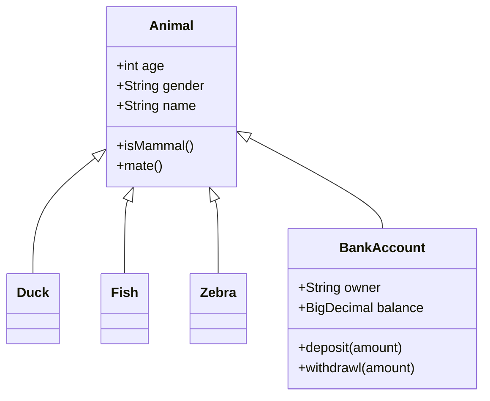

# Final Project WinForm_Abstract_Interface
 
## ชื่อผู้พัฒนา
นายธนภัทร วงษ์คำจันทร์
### Class Diagram

```mermaid
classDiagram
 Animal <|-- Duck
      Animal <|-- Fish
      Animal <|-- Zebra
       Animal <|-- BankAccount
      Animal : +int age
      Animal : +String gender
      Animal : +isMammal()
      Animal : +mate()
      Animal : +String name
      class BankAccount{
    +String owner
    +BigDecimal balance
    +deposit(amount)
    +withdrawl(amount)
}
```
